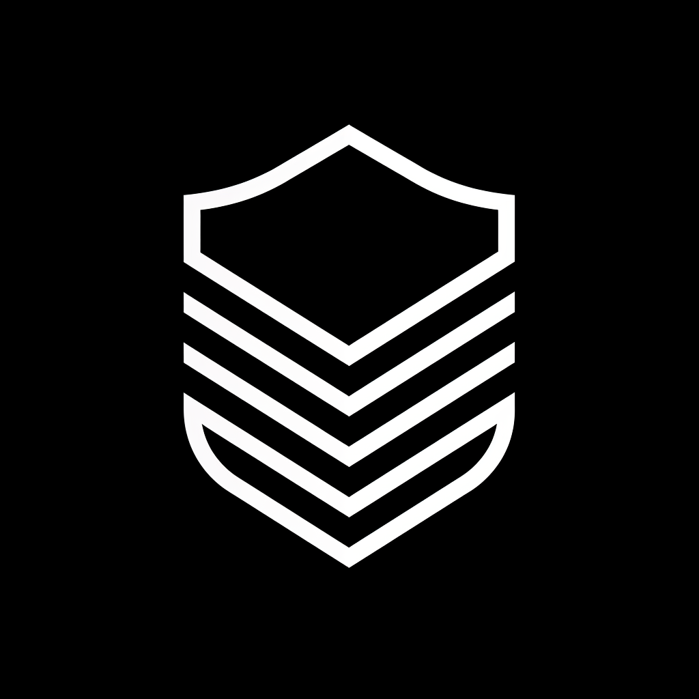

# Aegis

### Overview

Aegis protocol introduces a new security paradigm for Layer 2 networks, featuring an Escape Smart Contract system that ensures asset safety and network resilience. By implementing automated operation suspension, Layer 1 asset recovery mechanisms, and an insurance pool, it establishes a comprehensive security framework that sets a new standard for Layer 2 protection.

### Bountry

#### Sign Protocol

In Aegis, after AVS obtains users' asset information on L2 through Thegraph, it converts the data into a Merkle tree and records it. When L2 encounters issues, users can use this proof to prioritize withdrawals from guarantors. We utilize Sign Protocol to provide Attestations for the Merkle roots uploaded by AVS.

We created a Schema on Sepolia and implemented Attestation creation in the UpdateMerkleRoot function. We also employed SchemaHook to validate information such as BlockNumber validity, with plans to add Signature verification and other checks in the future.

Key components:
- Schema created on Sepolia for Merkle root attestations
- Attestation integration in UpdateMerkleRoot function
- SchemaHook implementation for validation
- Future enhancements for signature verification

Schema Structure:

```json
[
  {
    "name": "merkleRoot",
    "type": "bytes32"
  },
  {
    "name": "issuer",
    "type": "address"
  },
  {
    "name": "blockNumber",
    "type": "uint256"
  },
  {
    "name": "keyId",
    "type": "uint256"
  }
]
```

Schema: https://testnet-scan.sign.global/schema/onchain_evm_11155111_0x2fc
Create Attestation
https://testnet-scan.sign.global/schema/onchain_evm_11155111_0x2fd
Schema Hook: 
https://sepolia.etherscan.io/tx/0xe1eab7a4ee0280db155dfd512d02ea6800c73208204226e3c51a8a542f9a69ad#eventlog
Code: https://github.com/SpectreMercury/Aegis-Protocol/blob/main/contract/contracts/Aegis.sol#L255

Challenges we faced:
- We didn't find a suitable way to test the Attestation creation locally, which is a challenge for us to debugging it.


#### Scroll 

We deployed our smart contract on Scroll Devnet. 
However, due to a bug in the explorer's verify functionality, we haven't been able to verify the contract yet.

In Aegis, L1SLOAD helps us to communicate with L1 smart contract directly, which we use to read the L1 ownership of the asset.
Code: https://github.com/SpectreMercury/Aegis-Protocol/blob/main/contract/contracts/Aegis.sol#L147

Challenges we faced:
- We faced some issues with the Scroll Devnet, such as the verify function not working.
- We also faced some issues with finding the right slot for L1 smart contract. scripts scanning to slots doesn't work. you can see https://github.com/SpectreMercury/Aegis-Protocol/blob/main/contract/scripts/scroll.ts#L11 for more details.